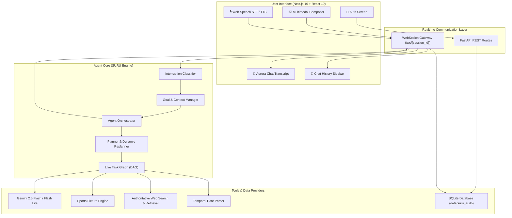

# SURU AI — Interruptible Real-Time Agent

> **"An AI assistant that doesn't restart when you change your mind."**

SURU AI is an autonomous, interruptible, real-time multimodal AI assistant. Unlike traditional conversational agents that process requests in isolated request-response cycles—or wipe their entire state on interruption—SURU maintains a live execution task graph, handles mid-turn interruptions with selective cancellation, grounds temporal queries, retrieves authoritative real-time sports and web data, and preserves persistent authenticated chat sessions in an SQLite database.

---

## 🔗 Project Links & Demos

- 🎥 **Video Demo**: [Watch Live Walkthrough & Demonstration](https://drive.google.com/file/d/1vtPbzgj58prOv5ormlv5-jhp5kluz6wF/view?usp=sharing)
- 📊 **Presentation Slides (PPT)**: [View Project Pitch & Architecture Slides](https://canva.link/tstdbygpbfq84o6)

---

## 🌟 Key Features

### 1. ⚡ Interruptible Agent Orchestration & Live Task Graph
- **Selective Cancellation**: When the user interrupts with a new goal or constraint, SURU cancels only affected subtasks rather than restarting from zero.
- **Context & Result Preservation**: Completed subtasks and verified data are retained across replans.
- **Interruption Classification**: Accurately classifies user speech and inputs into:
  - `BACKCHANNEL` ("uh-huh", "yeah", "got it") — Agent continues speaking without interruption.
  - `CLARIFICATION` — Clarifies existing plan.
  - `GOAL_CHANGE` — Selectively replans with diffing.
  - `HARD_STOP` — Instantly terminates speech and execution.
- **Dynamic Replanning**: Live DAG graph updates in-place during active generation.

### 2. 📅 Temporal Grounding & Authoritative Sports Data
- **Real-Time Date Grounding**: Dynamic temporal resolution (e.g., "upcoming matches this week", "yesterday's match", "IPL 2025 schedule") with UTC/local awareness.
- **Deep Sports Retrieval**: Authoritative multi-source web search and extraction for Cricket (IPL, ICC, Tests), Football (Premier League, Champions League, La Liga), and international tournaments.
- **Interactive Sports Cards**: Rich UI cards featuring team emblems, match dates, venues, status badges, and expandable details.

### 3. 📷 Multimodal Vision & Real-Time Voice
- **Vision Pipeline**: Direct image upload and multimodal inspection powered by Google Gemini.
- **Voice Synthesis & Interruption**: Integrated Speech-to-Text and Text-to-Speech with browser-native Web Speech API, real-time speaking indicators, and zero-latency audio cancel on user speech.
- **Voice Tuning**: Custom slider controls for speech pitch and rate in user preferences.

### 4. 🔒 Persistent User Authentication & Chat History
- **SQLite Database (`backend/db.py`)**: Persistent storage for user accounts, hashed credentials, and chat sessions.
- **Personalized Onboarding**: Automatic friendly greeting asking the user what SURU should call them.
- **Session Restoration**: Past chats are automatically saved and grouped in the sidebar (*Today*, *Yesterday*, *Earlier*) and restored upon login across reloads.
- **Export Transcripts**: One-click conversation export as formatted Markdown (`.md`) or raw JSON (`.json`).

### 5. 🌌 Premium Aurora Glassmorphism UI
- **Aesthetic**: Tailored Aurora Black (`#060907`) + Emerald Glow palette with organic moving celestial light plumes.
- **Conversational Focus**: Clean, distraction-free chat container with markdown formatting, code blocks, feedback thumbs, copy buttons, and audio playback.
- **Modern Left Rail & Drawer**: Quick access to Capabilities Gallery, Connected AI Engines, Voice Preferences, and System Settings.

---

## 🏗️ System Architecture



---

## 📁 Repository Structure

```
SURU-AI-Interruptible-Real-Time-Agent/
├── backend/
│   ├── agent/                 # Core reasoning, planning, and goal management
│   │   ├── context_manager.py
│   │   ├── goal_manager.py
│   │   ├── orchestrator.py
│   │   ├── planner.py
│   │   ├── replanner.py
│   │   └── response_manager.py
│   ├── execution/             # Task graph execution and async task handling
│   │   ├── task_executor.py
│   │   └── task_graph.py
│   ├── memory/                # Session memory and working memory buffers
│   │   └── session_memory.py
│   ├── providers/             # LLM provider adapters (Google Gemini, mock)
│   │   ├── base.py
│   │   └── google_gemini.py
│   ├── realtime/              # WebSocket events and live streams
│   │   └── events.py
│   ├── tools/                 # Execution tools
│   │   ├── base.py
│   │   ├── calculator.py
│   │   ├── database.py
│   │   ├── date_parser.py     # Relative & absolute date parsing
│   │   ├── search.py
│   │   ├── sports.py          # Real-time cricket/football fixture retrieval
│   │   └── web_search.py      # Authoritative web crawling & extraction
│   ├── config.py              # Application settings & environment parsing
│   ├── db.py                  # SQLite database engine (users & chat sessions)
│   ├── main.py                # FastAPI server and WebSocket endpoints
│   └── requirements.txt       # Python dependencies
│
├── frontend/
│   ├── app/
│   │   ├── globals.css        # Aurora emerald gradients and animations
│   │   ├── layout.tsx         # Root layout with fonts and metadata
│   │   └── page.tsx           # Main application view & auth gate
│   ├── components/            # React UI components
│   │   ├── sports/            # Sports fixture widgets and match cards
│   │   ├── AuthModal.tsx      # Fullscreen authentication modal (Login/Register)
│   │   ├── ChatHistorySidebar.tsx # Past session history & restore
│   │   ├── Header.tsx         # Top navigation pill with live status
│   │   ├── InputArea.tsx      # Rich composer with audio recording & image attachment
│   │   ├── MarkdownRenderer.tsx # GitHub-flavored markdown with code syntax
│   │   ├── NavDrawerModal.tsx # Preferences, engines, and settings drawer
│   │   ├── NavRail.tsx        # Left navigation icon rail
│   │   └── Transcript.tsx     # Clean AI conversation bubbles & action toolbar
│   ├── hooks/                 # Custom React hooks
│   │   ├── useChatHistory.ts  # Session storage & database sync
│   │   ├── useNexusWebSocket.ts # Live WebSocket connection manager
│   │   └── useSpeechSynthesis.ts # Voice synthesis & real-time cancel
│   ├── lib/                   # TypeScript interfaces and utility types
│   ├── package.json
│   └── tsconfig.json
│
├── data/
│   └── suru_ai.db             # SQLite database storing users and chat history
├── docs/
│   └── ARCHITECTURE.md        # Comprehensive technical architecture document
├── tests/                     # Comprehensive Pytest test suite (118+ test cases)
│   ├── conftest.py
│   ├── test_adversarial_global_routing.py
│   ├── test_auth_and_chat_database.py
│   ├── test_backend_api_and_interruption.py
│   ├── test_concurrency_and_hardening.py
│   ├── test_evaluation_scenarios.py
│   ├── test_gemini_provider.py
│   ├── test_general_purpose_agent.py
│   ├── test_interruption_categories.py
│   ├── test_multimodal_interaction.py
│   ├── test_sports_dates_and_voice.py
│   ├── test_sports_fixtures.py
│   ├── test_temporal_grounding.py
│   └── test_travel_planning_regression.py
└── README.md
```

---

## 🚀 Getting Started

### Prerequisites
- **Python**: 3.11 or higher
- **Node.js**: 18.x or higher (Node 20+ recommended)
- **Google Gemini API Key** (optional for live model reasoning; mock mode is available)

---

### Backend Setup

1. **Clone the repository and enter the directory**:
   ```bash
   git clone https://github.com/tsaksham1304/SURU-AI-Interruptible-Real-Time-Agent.git
   cd SURU-AI-Interruptible-Real-Time-Agent
   ```

2. **Create and activate a virtual environment**:
   ```bash
   # Windows PowerShell
   python -m venv venv
   .\venv\Scripts\Activate.ps1

   # Linux/macOS
   python3 -m venv venv
   source venv/bin/activate
   ```

3. **Install dependencies**:
   ```bash
   pip install -r backend/requirements.txt
   ```

4. **Configure environment variables**:
   Create a `.env` file in the project root:
   ```env
   # LLM Provider
   LLM_PROVIDER=google_gemini
   GOOGLE_API_KEY=your_gemini_api_key_here
   GEMINI_MODEL=gemini-2.5-flash

   # Server Settings
   BACKEND_HOST=0.0.0.0
   BACKEND_PORT=8000
   FRONTEND_URL=http://localhost:3000
   CORS_ORIGINS=http://localhost:3000
   ```

5. **Start the backend server**:
   ```bash
   uvicorn backend.main:app --host 0.0.0.0 --port 8000 --reload
   ```
   The backend API will be available at `http://127.0.0.1:8000` (API docs at `http://127.0.0.1:8000/docs`).

---

### Frontend Setup

1. **Navigate to the frontend folder**:
   ```bash
   cd frontend
   ```

2. **Install frontend dependencies**:
   ```bash
   npm install
   ```

3. **Start the development server**:
   ```bash
   npm run dev
   ```
   Open `http://localhost:3000` in your web browser.

---

## 🧪 Running the Test Suite

The project includes over 118 automated test cases verifying agent planning, interruption classification, temporal grounding, concurrency, sports retrieval, database operations, and authentication:

```bash
# Run all tests
python -m pytest tests/

# Run database & authentication tests
python -m pytest tests/test_auth_and_chat_database.py

# Run sports & date grounding tests
python -m pytest tests/test_sports_fixtures.py tests/test_sports_dates_and_voice.py

# Run adversarial global routing tests
python -m pytest tests/test_adversarial_global_routing.py
```

---

## 🔌 API & WebSocket Reference

### WebSocket Endpoint: `/ws/{session_id}`
Establishes a bidirectional real-time communication channel:
- **Client to Server**:
  - `user_message`: `{ "type": "user_message", "content": "..." }`
  - `speech_started`: `{ "type": "speech_started" }` (triggers instant audio interruption)
  - `image_upload`: `{ "type": "image_upload", "image_data": "..." }`
- **Server to Client**:
  - `agent_thought`: Live reasoning and execution steps
  - `agent_response`: Streaming text chunks and final responses
  - `interruption_signal`: Status update acknowledging cancellation or clarification
  - `sports_fixtures`: Structured match data payload for rich card rendering

### REST Endpoints
- `POST /api/auth/register`: Create account (`email`, `password`, `display_name`).
- `POST /api/auth/login`: Authenticate and receive session token.
- `GET /api/user/{user_id}/chats`: Fetch all stored chat sessions for user.
- `POST /api/user/{user_id}/chats`: Persist/update conversation transcript.
- `DELETE /api/user/{user_id}/chats/{session_id}`: Delete conversation.

---

## 🛡️ License

This project is licensed under the MIT License. See [LICENSE](LICENSE) for details.
