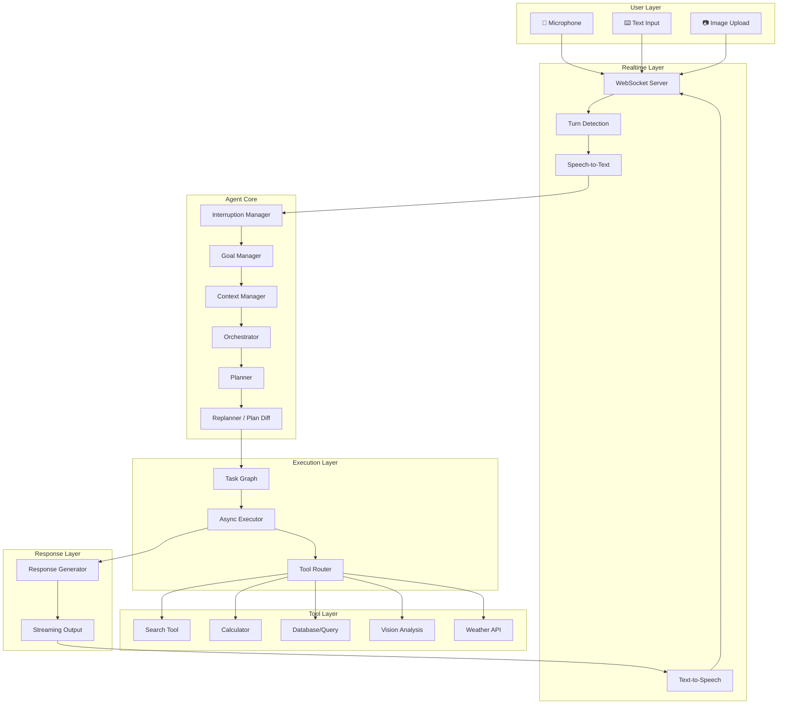
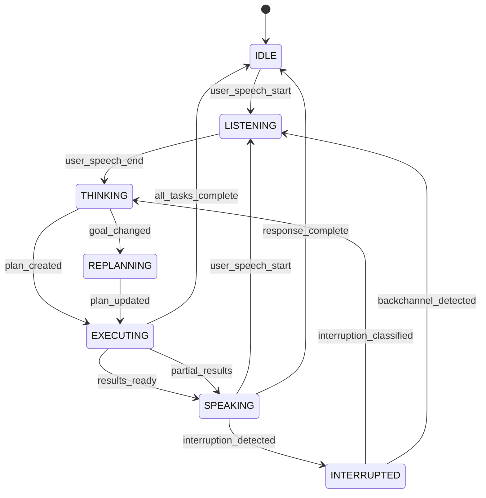
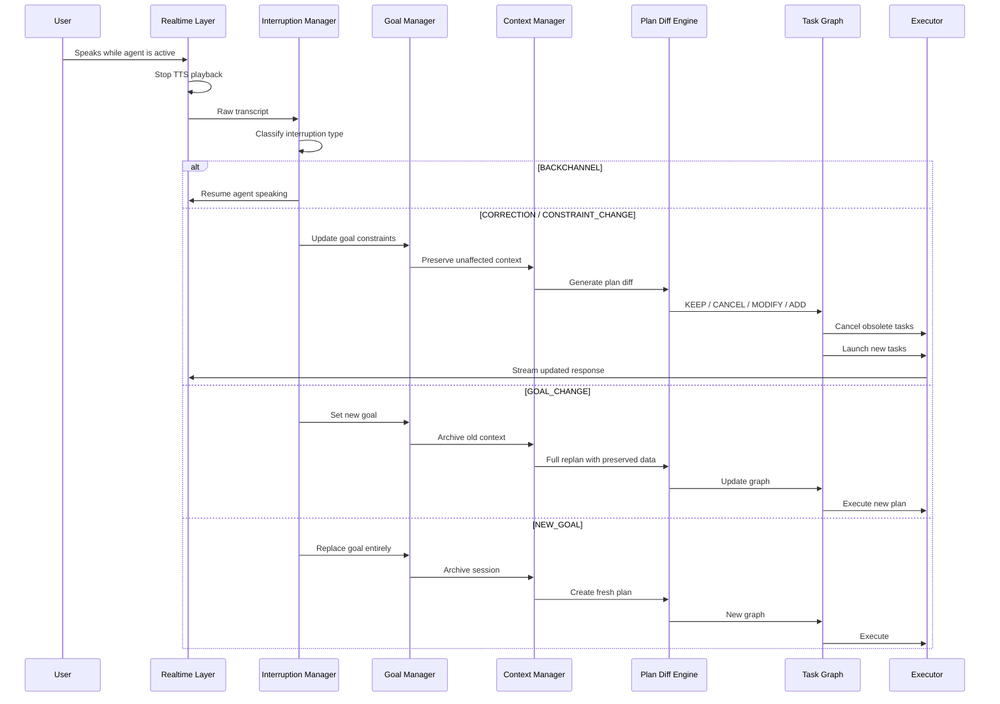
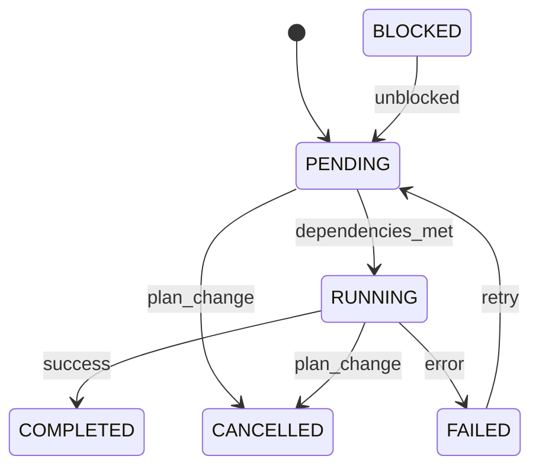

# SURU AI — Architecture Document

> **"Hey SURU — An AI agent that doesn't restart when you change your mind."**

## 1. System Overview

SURU AI is an interruptible real-time agent. Unlike traditional chatbots that process one request at a time, SURU AI maintains a live task graph, executes work asynchronously, and intelligently handles user interruptions without discarding useful progress.



## 2. Core Innovation: Interruptible Agent Orchestration

### The Problem

Traditional AI agents:
- Process one request, return one response
- If interrupted, restart from scratch
- Treat every user utterance as a new conversation turn
- Discard all in-progress work on any interruption

### NEXUS Approach

NEXUS maintains a **live execution graph** with these capabilities:

| Capability | Description |
|---|---|
| **Selective Cancellation** | Only cancel tasks affected by the interruption |
| **Context Preservation** | Keep useful completed results across replans |
| **Plan Diffing** | Compare old plan vs new plan to minimize wasted work |
| **Interruption Classification** | Distinguish backchannels from goal changes |
| **Dynamic Replanning** | Update the task graph in-place, not from scratch |
| **Concurrent Execution** | Run independent tasks in parallel |

## 3. Agent State Machine



### Agent States

| State | Description | UI Indicator |
|---|---|---|
| `IDLE` | No active work | Dim orb, slow pulse |
| `LISTENING` | Capturing user audio | Blue rings expand |
| `THINKING` | Processing input, planning | Purple pulse |
| `EXECUTING` | Running async tasks | Cyan activity arcs |
| `SPEAKING` | Streaming voice response | Green waveform |
| `INTERRUPTED` | User barged in | Amber flash |
| `REPLANNING` | Updating task graph | Orange rotation |

## 4. Interruption Flow



### Interruption Categories

| Type | Impact | Example |
|---|---|---|
| `BACKCHANNEL` | None - continue | "yeah", "okay" |
| `CORRECTION` | Modify one constraint | "Chennai, not Bangalore" |
| `QUESTION` | Pause, answer, resume | "Why that hotel?" |
| `CONSTRAINT_CHANGE` | Update constraint, partial replan | "Budget is 10,000" |
| `GOAL_CHANGE` | Replan affected tasks | "Find hostels, not hotels" |
| `TASK_CANCELLATION` | Cancel specific tasks | "Stop looking at hotels" |
| `NEW_GOAL` | Archive and start fresh | "Forget travel. Help me study." |

## 5. Task Graph

### Task Schema

```python
@dataclass
class Task:
    id: str
    name: str
    description: str
    status: TaskStatus          # PENDING | RUNNING | COMPLETED | CANCELLED | FAILED | BLOCKED
    tool: str                   # Tool to execute
    input: dict                 # Parameters
    output: Optional[dict]      # Results
    dependencies: List[str]     # Task IDs this depends on
    priority: int               # Execution priority
    created_at: datetime
    started_at: Optional[datetime]
    completed_at: Optional[datetime]
    cancellation_reason: Optional[str]
    affected_by: Optional[str]  # Interruption ID that affected this task
```

### Valid State Transitions



### Concurrent Execution Model

Independent tasks run concurrently. Downstream tasks wait for their dependencies.

## 6. Plan Diff Engine

The Plan Diff Engine is the core technical innovation. When a user changes their goal or constraints:

```
OLD PLAN  ->  NEW PLAN  ->  DIFF  ->  Actions
```

### Diff Actions

| Action | Meaning |
|---|---|
| `KEEP` | Task is unaffected, preserve results |
| `CANCEL` | Task is obsolete, terminate if running |
| `MODIFY` | Task needs updated parameters |
| `ADD` | New task required by updated goal |

### Example

**Old Goal:** "Gaming laptop under 70,000"

**Interruption:** "Actually for machine learning. Keep the budget."

| Task | Action | Reason |
|---|---|---|
| search_laptops | `KEEP` | Results still useful |
| gaming_benchmark | `CANCEL` | Irrelevant to ML |
| price_comparison | `KEEP` | Budget unchanged |
| cuda_analysis | `ADD` | New ML requirement |
| gpu_vram_check | `ADD` | New ML requirement |
| recommendation | `MODIFY` | Criteria changed |

## 7. Context Manager

### Session Context Structure

```python
@dataclass
class SessionContext:
    session_id: str
    current_goal: Optional[Goal]
    constraints: Dict[str, Any]
    preferences: Dict[str, Any]
    completed_findings: List[Finding]
    active_tasks: List[str]
    pending_tasks: List[str]
    cancelled_tasks: List[str]
    conversation_summary: str
    important_decisions: List[str]
    interruption_history: List[Interruption]
```

### Context Preservation Strategy

- **Never discard completed findings** unless the entire goal changes
- **Summarize conversation** instead of replaying full history
- **Track constraints separately** from conversation
- **Version constraints** to support undo

## 8. API Design

### WebSocket Protocol

All realtime communication uses a single WebSocket connection with typed messages:

```typescript
// Client -> Server
interface ClientMessage {
  type: 'audio_chunk' | 'text_input' | 'image_upload' | 'interrupt' | 'control';
  payload: any;
  timestamp: number;
  session_id: string;
}

// Server -> Client  
interface ServerMessage {
  type: 'agent_state' | 'transcript' | 'audio_chunk' | 'task_update' | 
        'goal_update' | 'context_update' | 'event' | 'error';
  payload: any;
  timestamp: number;
  session_id: string;
}
```

### REST Endpoints

| Method | Path | Description |
|---|---|---|
| `POST` | `/api/session` | Create new session |
| `GET` | `/api/session/{id}` | Get session state |
| `DELETE` | `/api/session/{id}` | End session |
| `GET` | `/api/session/{id}/tasks` | Get task graph |
| `GET` | `/api/session/{id}/context` | Get session context |
| `GET` | `/api/session/{id}/events` | Get event timeline |
| `POST` | `/api/session/{id}/demo` | Start demo scenario |
| `GET` | `/api/evaluation/results` | Get evaluation results |
| `POST` | `/api/evaluation/run` | Run evaluation suite |

### Event Types

```python
class EventType(str, Enum):
    SESSION_STARTED = "SESSION_STARTED"
    USER_SPEECH_STARTED = "USER_SPEECH_STARTED"
    USER_SPEECH_ENDED = "USER_SPEECH_ENDED"
    AGENT_SPEAKING = "AGENT_SPEAKING"
    INTERRUPTION_DETECTED = "INTERRUPTION_DETECTED"
    INTERRUPTION_CLASSIFIED = "INTERRUPTION_CLASSIFIED"
    GOAL_CHANGED = "GOAL_CHANGED"
    PLAN_CREATED = "PLAN_CREATED"
    PLAN_UPDATED = "PLAN_UPDATED"
    TASK_STARTED = "TASK_STARTED"
    TASK_COMPLETED = "TASK_COMPLETED"
    TASK_CANCELLED = "TASK_CANCELLED"
    TOOL_CALLED = "TOOL_CALLED"
    TOOL_COMPLETED = "TOOL_COMPLETED"
    CONTEXT_PRESERVED = "CONTEXT_PRESERVED"
    AGENT_RESUMED = "AGENT_RESUMED"
```

## 9. Realtime Architecture

### Audio Pipeline

1. **Capture**: Browser MediaRecorder -> PCM chunks (16kHz, mono)
2. **Transport**: WebSocket binary frames
3. **STT**: Streaming transcription via provider abstraction
4. **Processing**: Orchestrator pipeline
5. **TTS**: Streaming synthesis via provider abstraction
6. **Playback**: WebSocket -> AudioContext -> Speaker

### Interruption Detection (Client-Side)

- Monitor microphone VAD while agent audio is playing
- On voice detected -> send `interrupt` message
- Server immediately stops TTS stream
- Client stops audio playback
- Transition to `INTERRUPTED` state

## 10. LLM Provider Abstraction

```python
class LLMProvider(ABC):
    @abstractmethod
    async def generate(self, messages, **kwargs) -> AsyncIterator[str]:
        """Stream text generation."""
        
    @abstractmethod
    async def classify(self, text: str, categories: List[str]) -> Classification:
        """Classify text into categories."""
    
    @abstractmethod
    async def analyze_image(self, image: bytes, prompt: str) -> str:
        """Analyze an image with a prompt."""

    @abstractmethod
    async def plan(self, goal: str, context: SessionContext) -> Plan:
        """Generate an execution plan."""
```

## 11. Tool Architecture

```python
class Tool(ABC):
    name: str
    description: str
    
    @abstractmethod
    async def execute(self, params: dict, cancel_event: asyncio.Event) -> ToolResult:
        """Execute tool with cancellation support."""

    @abstractmethod
    def validate_params(self, params: dict) -> bool:
        """Validate input parameters."""
```

Every tool:
- Accepts a `cancel_event` for cooperative cancellation
- Returns structured `ToolResult`
- Has deterministic mock fallbacks
- Reports progress events

## 12. Deployment Architecture

### Local Development

```bash
# Backend
cd backend && pip install -r requirements.txt && uvicorn main:app --reload

# Frontend  
cd frontend && npm install && npm run dev
```

### Production

```bash
docker-compose up --build
```

## 13. Security

- API keys stored in `.env`, never in frontend code
- Backend proxies all AI API calls
- WebSocket connections authenticated per-session
- Image uploads validated (type, size <= 10MB)
- Tool parameters sanitized
- Rate limiting on API endpoints
- CORS configured for frontend origin only
